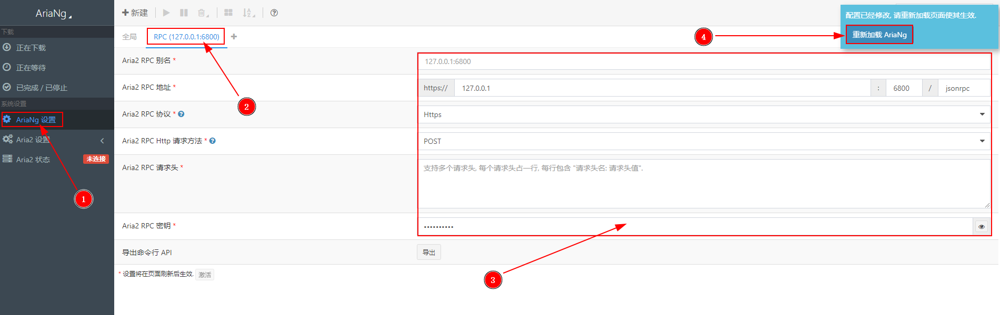

## 前言

### 介绍

Aria2 是目前最强大的全能型下载工具，它支持 BT、磁力、HTTP、FTP 等下载协议，常用做离线下载的服务端。

AriaNg 是一个让 Aria2 更容易使用的现代 Web 前端。 AriaNg 使用纯 html & javascript 开发，所以其不需要任何编译器或运行环境.。您只要将 AriaNg 放在您的 Web 服务器里并在浏览器中打开即可使用；AriaNg 使用响应式布局，支持各种计算机或移动设备。

### 特性

#### Aria2

1. BT 下载率高、速度快
   
2. 重启后不丢失任务进度、不重复下载

3. 删除正在下载的任务自动删除未完成的文件

4. 下载错误自动删除未完成的文件

5. 下载完成自动删除控制文件(.aria2后缀名文件)

6. 下载完成自动删除种子文件(.torrent后缀名文件)

7. 下载完成自动删除空目录

8. BT 下载完成自动清除垃圾文件(文件类型过滤功能)

9. BT 下载完成自动清除小文件(文件大小过滤功能)

10. 有一定的防版权投诉、防迅雷吸血效果

11. 更好的 PT 下载支持

#### AriaNG

1. 纯 Html & Javascript 实现, 不依赖任何运行时
   
2. 响应式布局设计, 兼容计算机与移动设备
   
3. 友好的界面交互
   
    - 任务排序 (按文件名, 文件大小, 进度, 剩余时间, 下载速度等.), 文件排序, Bittorrent 连接节点排序
  
    - 任务搜索

    - 任务重试
  
    - 拖拽调整任务顺序
  
    - 更详细的任务信息 (健康度, 连接节点客户端信息等.)
  
    - 根据特定文件类型或文件扩展名筛选文件 (视频, 音频, 图片, 文档, 应用程序, 存档文件等.)
  
    - 多目录任务支持树形结构显示
  
    - Aria2 及单个任务的下载/上传速度图表
  
    - 完整支持 Aria2 设置选项

4. 深色主题
   
5. 支持网页地址命令行 API
   
6. 下载完成消息通知
   
7. 多语言支持
   
8. 支持配置多个 aria2 RPC
   
9. 支持导出和导入设置
    
10. 节省带宽, 仅请求增量数据

---

## 安装配置

### Aria2 安装配置

这里使用的一键安装管理脚本增强版；[Github 项目地址](https://github.com/P3TERX/aria2.sh)

输入命令进行下载、运行脚本：

```bash
wget -N git.io/aria2.sh && chmod +x aria2.sh
./aria2.sh
```

运行脚本后，会进入管理面板：

```bash
 Aria2 一键安装管理脚本 增强版 [v2.7.4] by P3TERX.COM
 
  1. 升级脚本
 ———————————————————————
  1. 安装 Aria2
  2. 更新 Aria2
  3. 卸载 Aria2
 ———————————————————————
  1. 启动 Aria2
  2. 停止 Aria2
  3. 重启 Aria2
 ———————————————————————
  1. 修改 配置
  2. 查看 配置
  3. 查看 日志
 1.  清空 日志
 ———————————————————————
 1.  手动更新 BT-Tracker
 2.  自动更新 BT-Tracker
 ———————————————————————

 Aria2 状态: 已安装 | 已启动

 自动更新 BT-Tracker: 已开启

 请输入数字 [0-12]:
```

输入 `1` 进行安装，安装完成之后会跳出配置信息：


你可以通过执行 `./aria2.sh` 然后输入 `7` 回车修改配置；记录下配置信息，然后继续进行下一步。

---

### AriaNG 安装配置

- 项目地址：[Github 项目地址](https://github.com/mayswind/AriaNg)

首先创建一个网站，可以参考 [Oneinstack 创建虚拟主机](/p/oneinstack/#创建虚拟主机) 或 [Caddy 创建站点](/p/caddy/)

然后打开 [下载版本](https://github.com/mayswind/AriaNg/releases/) 页面，将 AriaNG-x.x.x.zip 文件下载上传至网站根目录，并解压。

访问该网站域名，首次访问会跳出认证错误提示，关闭掉然后进行设置：



点击 `AriaNG设置` - `RPC` 然后将之前记录好的 Aria 配置信息中的 `IPV4 地址、端口` 填入 `Aria2 RPC 地址` 然后填入 `Aria2 RPC 密钥`；并点击 `重新加载 AriaNG`

配置完成重载后即可进行离线下载。

---

### 扩展设置

如果你不想通过 http://127.0.0.1:6800 进行连接 Aria2，那么可以进行反代，通过域名连接：

修改 AriaNG 网站配置，添加下面的配置：

- Nginx
  
```nginx
location = /jsonrpc {
    proxy_pass http://127.0.0.1:6800;
    proxy_set_header X-Forwarded-For $proxy_add_x_forwarded_for;
    proxy_set_header Host $http_host;
    proxy_set_header X-Real-IP $remote_addr;
    proxy_set_header X-NginX-Proxy true;
    proxy_http_version 1.1;
}
```

- Caddy
  
```caddyfile
domain.com {
    reverse_proxy /jsonrpc 127.0.0.1:6800
}
```

然后在 AriaNG 中修改 Aria2 RPC 地址为：`https://domian.com:443/jsonrpc`
