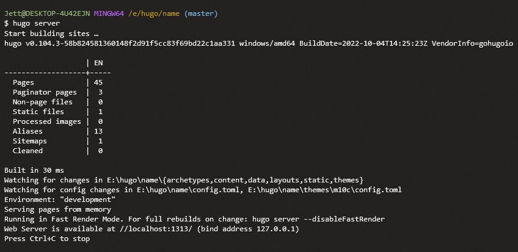
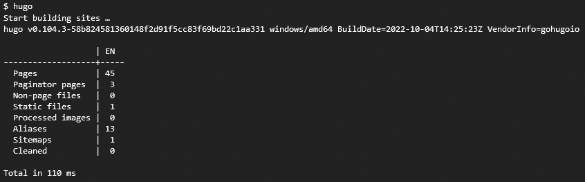
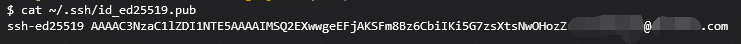
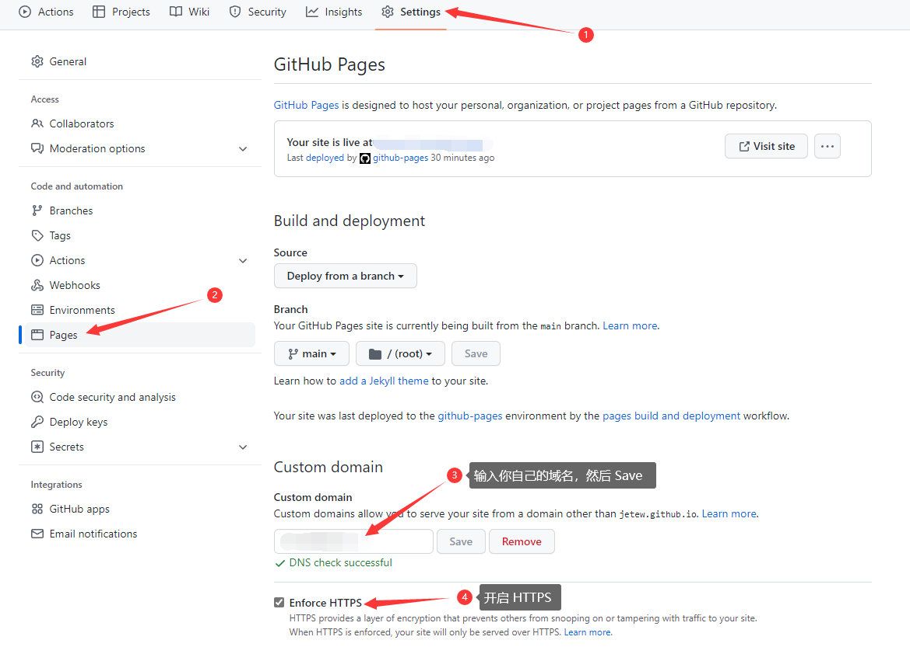

## 前言

很早开始就接触到个人博客这块了，一开始是到处泛滥的 YH 、 BY 分销；各种免费主机，再到后来自己买虚拟主机、VPS 进行个人博客的使用；由于我懒得备案，于是一直用的是海外的服务器；但是海外服务器也有问题，就是访问体验相较于国内还是比较差的。 WordPress 的话，对我个人而言感觉比较臃肿，所以后面又用了 Typecho ；到最后工作、生活等诸多琐事导致没有太多的时间去进行打理，而且服务器的长期维护也是一笔不小的开支。

<!--more-->

到后面我发现了 Hugo + GitHub Pages 这一方案，既可以进行托管，节省了许多维护心力，又能随时进行写作；虽然在部署与搭建上需要进行一些配置，但是后续更新和维护还是比较方便的。因此，在这里将博客系统搭建及部署进行记录，希望对大家有所帮助。

### 博客程序选择

目前已经有很多比较成熟的博客平台，如前文所提到的 WordPress，虽然功能强大，但对于个人博客站点来说有些太臃肿了，我认为个人博客就是自己在上面写一些东西，进行一个分享与记录；轻巧一点会比较好。而 Typecho 等轻量级博客程序就挺符合我的口味，但是如前文所说，我并没有太多的时间去进行打理和维护；经过一段时间的寻找与调研，我最终选择了 Hugo 这个高效的静态网站生成器。

### 关于 Hugo
- [Hugo 官网](https://gohugo.io)

Hugo - 世界上最快的网站构建框架，Hugo 是最流行的开源静态站点生成器之一。 凭借其惊人的速度和灵活性，Hugo 让构建网站再次变得有趣。（来自官网介绍）

Hugo 是用 Golang 编写的网站构建程序，采用 Markdown 进行文章编辑，自动生成静态站点文件，支持丰富的主题配置，也可以通过 js 嵌入像是评论系统等插件，高度定制化。除了 Hugo 外， 还有 Jekyll、Hexo、VuePress、Gitbook、Docsify 等选择，实现和使用都差不多，可以根据自己的偏好进行选择。

---

## 安装与部属

### 安装 Hugo 及相关程序

#### 安装 Hugo 

Windows 用户使用 Chocolatey 安装

```bash
choco install hugo -confirm
```

不想使用 Chocolatey 管理包的话也可以直接到官网下载程序到本地目录，然后添加环境变量

MacOS 用户使用 Homebrew 安装

```bash
brew install hugo
```

安装完成后通过 `hugo version` 进行验证安装

#### 安装 Git

- [Git 官网](https://git-scm.com)

下载完成后按照默认配置，一路下一步即可完成安装。

#### 安装 VS Code

- [VS Code 官网](https://code.visualstudio.com)

下载适合自己系统的版本，然后一路默认配置安装即可。

VS Code 插件推荐：

> `Markdown All in One` Markdown 写作利器
>  
> `Chinese Language Pack for Visual Studio Code` VS Code 汉化插件
>
> `Auto Rename Tag` 涉及修改代码时很好用

---

### 创建 Hugo 网站及配置

#### 创建网站

我这里的操作均在 Windows 系统下，其他系统步骤都一样。

打开 Git Bash 进入到需要放置网站的目录，即可通过 `hugo new site` 命令进行创建网站了：

```bash
cd /e # 进入E盘
mkdir hugo # 创建 hugo 文件夹
cd hugo # 进入hugo文件夹
hugo new site name # 创建新网站，name可以自行设置
```


#### 配置主题

当通过上文命令创建我们的站点后，需要进行主题配置，Hugo 拥有丰富的主题，可以通过官网 `Themes` 菜单选择自己喜欢的风格，查看预览效果，选择后可以进入主题项目仓库，一般都会有很详细的安装及配置说明。下面我就以 `m10c` 这个主题为例，演示一下配置流程。

##### 关联主题仓库

我们可以将主题仓库直接 `git clone` 下来进行使用，但这种方式有一些弊端，当之后自己对主题进行修改后，可能会与原主题产生一些冲突，不方便版本管理与后续更新。我采用的是 `git submodule` 方式进行仓库链接，这样后续可以对主题的修改进行单独维护。

```bash
cd name
git init
git submodule add https://github.com/vaga/hugo-theme-m10c.git themes/m10c
```


##### 更新主题

如果需要同步主题仓库的最新修改，运行以下命令：

```bash
git submodule update --remote
```

##### 初始化主题配置

每个主题一般都会提供一些实例配置与初始页面，开始使用主题时可以将其 `exampleSite/` 演示站点目录下的文件复制到站点目录下，在此基础上进行调整配置。

```bash
cp -rf themes/m10c/exampleSite/* ./
```

初始化主题基础配置后，我们可以在 `config.toml` 文件中进行站点细节配置，将博客站点配置文件中的 `baseURL` 改为自己的域名，或者直接设置为 `/` ；其余具体配置项参考各主题说明文档，或者作者主题仓库中的详细说明。

##### 调试主题

完成一些基本的站点配置后，我们就可以通过 `hugo server` 命令进行本地实时预览：



运行服务后，我们可以通过浏览器 http://localhost:1313 地址访问我们的本地预览网页：


#### 发布新文章

上述操作都完成后，就可以进行新文章的发布了，通过 `hugo new` 命令即可进行发布新文章

```bash
hugo new posts/start.md
```

发布新文章后，我们就可以通过 VS Code 进行编辑了。

---

### 部署网站

#### Git Pages 设置

##### 开通 Github Pages 仓库

Github Pages 项目仓库需要符合 `username.github.io` 的特殊命名格式，这样博客站点才能正常访问 GitHub Pages 生成的网站服务。


##### 生成静态文件

配置完主题，并发布新文章之后，就可以通过 `hugo` 命令来生成静态网页文件

```bash
hugo
```



##### 发布站点

Hugo 默认会将生成的静态网页文件存放在 public 目录下，我们可以通过将 public 目录初始化为本地仓库，并关联我们的 Github 远程仓库来推送我们的网页静态文件。

```bash
cd public
git init
git add .
git branch -M main # 好像现在官方默认是main分支
git commit -m "博客第一次提交"
```


提交到本地仓库后，就可以开始推送到 Github 远程仓库了；在此之前要先进行一些设置：

###### 添加密钥

这个密钥是用来安全连接 Github 远程仓库的，使用 Https 方式连接可能会出现各种问题，输入下面命令生成密钥，然后按下几次回车即可：

```bash
ssh-keygen -t ed25519 -C "你的Github邮箱"
```


生成完毕后输入 `cat ~/.ssh/id_ed25519.pub` 查看公钥内容：



复制展示出来的公钥，然后打开 Github 点击 `右上角头像 - Settings - SSH and GPG keys - New SSH Key` 把刚才复制的公钥粘贴到 `Key` 中，命名随意，然后保存：


然后回到 `Git Bash` 添加远程仓库

```bash
git remote add origin git@github.com:username/username.github.io.git # username换成你的github用户名
git push origin main
```

之后会提示你是否将 `github.com` 添加到主机列表，输入 yes 回车即可


推送完成后，稍等几分钟即可通过 Github Pages 域名 `username.github.io` 来访问我们的博客站点了。

---

## 绑定域名

推送完毕后就可以绑定自己的域名了，绑定域名前，先到你的域名服务商或者 DNS 提供商处添加 `CNAME` 记录解析到 `username.github.io` 也就是你的 Github Pages 仓库名 (我这里是 CloudFlare ) ：


进入 Github Pages 仓库，点击 `Settings - Pages` 找到 Custom domain 输入你自己的域名，等待验证 DNS 后开启 HTTPS ：



---

## 总结

以上就是使用 Hugo 与 Github Pages 搭建个人博客的一个简单过程；后续还会进行更加详细的解读与说明，希望能够对大家有所帮助。