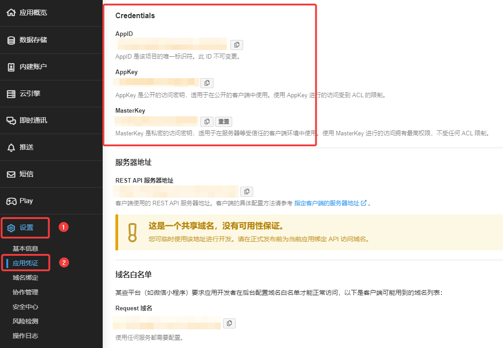

## 前言

我的博客作为自己记录的地方，没有去做 SEO 也没有去进行优化；可以说完全没有必要去开启评论，但是为什么又添加了评论呢？我觉得万一有人看到了我博客中的一些内容，有什么没有了解的地方，或者说有什么地方需要进行交流，需要进行简单的评论该怎么办？为了这一两句话不可能去到邮箱里跟你进行深度交流，于是最后还是决定开启评论功能，并再此进行一个分享。

<!--more-->

### 评论系统选择

对于评论系统，我的感觉是一定要便捷，填上昵称，邮件等就可以进行评论，不需要进行注册等繁琐操作； Hugo 中也有许多自带的评论系统，但是大多数都是海外的，使用起来很不方便。最终决定使用基于 Valine 的 Waline ；下面就来讲一下我自己配置的过程。

---

## 通用配置

### 注册 LeanCloud

- [LeanCloud 国际版](https://leancloud.app)

推荐使用国际版，国内版的话需要绑定已备案域名，比较麻烦。。。首先 [登陆](https://console.leancloud.app/login) 或 [注册](https://console.leancloud.app/register) **LeanCloud国际版** 并进入 [控制台](https://console.leancloud.app/apps)

进入控制台后，点击创建应用，输入你喜欢的应用名称，选择开发版，然后点击创建：


进入应用，选择左下角的 **设置 > 应用凭证** 。你可以看到你的各种凭证，先放在这里，后面会用上：



---

## 评论系统配置

### Valine 配置

一般来说 Valine 是 Hugo 主题里自带集成的，去稍微配置下就可以使用了；以我正在使用的 Zzo 主题演示。打开博客根目录，找到 **config/_default** 打开 **params.toml** 配置文件，然后按照下面注释进行修改：

有的主题就是在根目录的 **config.toml** ，需要自己去查看；所有修改应该基于博客根目录，不要去动主题中的文件；渲染时会对主题目录的配置进行覆盖，即：将主题中需要修改的文件复制到博客根目录对应位置，再修改博客根目录文件。

```toml
# comment
enableComment = true # 开启评论
disqus_shortname = ""
commento = false

# Valine.
# You can get your appid and appkey from https://leancloud.cn
# more info please open https://valine.js.org
[valine]
  enable = true # 开启 Valine
  appId = '' # AppID 为 你在 LeanCloud 应用凭证中的 AppLD
  appKey = '' # AppKey 为 你在 LeanCloud 应用凭证中的 AppKey
  notify = false  # 
  verify = false # 
  avatar = 'mp' 
  placeholder = '说点什么吧...'
  visitor = false
```
> 配置项及参数参考： [配置项](https://valine.js.org/configuration.htmlValine)

一般来说，主题的 Valine 评论系统，直接在主题配置文件中设置相应的参数开启即可。如果不是自带的可以往下看 Waline 的操作。

---

### Waline 配置

#### 通过 Vercel 部署服务端

- 这一部分可以直接看官方给出的教程 [部署 ( 服务端 )](https://waline.js.org/guide/get-started.html#vercel-部署-服务端Vercel)

#### 引入 Waline 及配置

我正在用的 Zzo 主题是不自带 Waline 的，所以我就要进行引入；Zzo 主题关于评论系统的文件夹与文件分别为：

> - ~/themes/zzo/layouts/partials/comments
> - ~/themes/zzo/layouts/partials/comments/comments.html
> - ~/config/_default/params.toml

和上文一样，修改主题的原则是将主题目录中的文件复制到你博客所在根目录的相同位置进行修改，不要对主题文件夹中的文件进行直接修改；这样做的好处是以后更新主题时，你所做的修改不会被覆盖。

首先打开主题文件夹的 **layouts/partials/comments** 找到 **comments.html** 和 **valine.html** 将其复制到博客根目录对应位置，先打开 **comment.html** 进行编辑，按照相同的格式，加上 Waline：

```diff
{{ if $.Param "enableComment" }}
  {{ if $.Param "disqus_shortname" }}
    {{ partial "comments/disqus.html" . }}
  {{ else if $.Param "commento" }}
    {{ partial "comments/commento.html" . }}
  {{ else if $.Param "valine.enable" }}
    {{ partial "comments/valine.html" . }}
  {{ else if $.Param "changyan.changyanAppid" }}
    {{ partial "comments/changyan.html" . }}
  {{ else if $.Param "livere.livereUID" }}
    {{ partial "comments/livere.html" . }}
  {{ else if $.Param "gitment.owner" }}
    {{ partial "comments/gitment.html" . }}
  {{ else if $.Param "gitalk.owner" }}
    {{ partial "comments/gitalk.html" . }}
  {{ else if $.Param "utterances.owner" }}
    {{ partial "comments/utterances.html" . }}
  {{ else if $.Param "isso.enable" }}
    {{ partial "comments/isso.html" . }}
  {{ else if $.Param "telegram.enable" }}
    {{ partial "comments/telegram.html" . }}
+ {{ else if $.Param "waline.enable" }}
+   {{ partial "comments/waline.html" . }}  
  {{ end }}
{{ end }}
```

然后再打开 **waline.html** ，按照官方给出的 [从 Valine 迁移](https://waline.js.org/migration/valine.html) 进行引入：

```diff
-<script src='//unpkg.com/valine/dist/Valine.min.js'></script>
+<script src='//unpkg.com/@waline/client@v2/dist/waline.js'></script>
+<link href='//unpkg.com/@waline/client@v2/dist/waline.css' rel='stylesheet' />
 <script>
-  new Valine({
+  Waline.init({
     el: '#vcomments',
-    appId: 'Your appId',
-    appKey: 'Your appKey'
+    serverURL: 'YOUR SERVER URL'
   });
 </script>
```

基本的引入完成后，打开 **config/_default/params.toml** 添加 Waline 并设置：

```toml
[waline]
  enable = true
  ServerURL = '' # 服务端网址是你给 Vercel 服务端绑定的域名
```

如果你想进行一些个性化的设置，可以参考以下官网。下面是我自己的一个简单的配置：

- **~/config/_default/params.tomlparams.toml**

  ```toml
  [waline]
  enable = true
  ServerURL = 'https://domain.com'
  Lang = 'zh-CN'
  Meta = ['nick', 'mail', 'link']
  RequiredMeta = ['nick']
  Login = 'disable'
  PageSize = '10'
  HighLighter = true
  ```

- **~/layouts/partials/comments/waline.html**

  ```html
  <div id="vcomments"></div>
  <script src='//unpkg.com/@waline/client@v2/dist/waline.js'></script>
  <link href='//unpkg.com/@waline/client@v2/dist/waline.css' rel='stylesheet' />
  <script>
    Waline.init({
      el: '#vcomments' ,
      locale: {
        placeholder: '请注意评论礼仪，发布攻击性、无意义内容将会视为垃圾评论进行删除处理。',
        nick: '昵称*'
      },
      serverURL: '{{ .Site.Params.waline.ServerURL }}',
      emoji: [
        '//unpkg.com/@waline/emojis@1.1.0/alus',
        '//unpkg.com/@waline/emojis@1.1.0/tieba'
      ],
      lang: '{{ .Site.Params.waline.Lang }}',
      meta: {{ .Site.Params.waline.Meta }},
      requiredMeta: {{ .Site.Params.waline.RequiredMeta }},
      login: '{{ .Site.Params.waline.Login }}',
      pageSize: '{{ .Site.Params.waline.PageSize }}',
      highlighter: {{ .Site.Params.waline.Highlighter }}
    });
  </script>
  ```

配置完成之后你就可以在运行 `hugo server` 在本地进行评论测试了:


---

### 评论管理

Waline 带有后台，可以实现对评论的管理。部署完成后访问 `<serverURL>/ui/register` 进行注册，第一个注册的账户会被设定成管理员。

登录成功后就可以看到评论管理的界面了。在这里可以修改、标记或删除评论。在评论的时候，如果选择登陆账户后进行评论，你的评论昵称后面会显示「博主」字样。如果没有登陆后台评论，一样是不会显示的。

## 总结

以上就是 Hugo 博客添加评论系统的过程，希望能给大家做一个参考；至于使用什么评论系统也是看自己的喜好和选择了。没有什么是最好的，只有最适合你自己的。到此 Hugo 搭建博客的一个入门流程也算是结束了，以后自己折腾多了，有时间了；也会进行更进一步的发掘和分享。

## 参考资料

1. [LeanCloud 国际版](https://leancloud.app)
   
2. [Valine 官网](https://valine.js.org)
   
3. [Vrecel 官网](https://vercel.com)
   
4. [Waline 官网](https://waline.js.org)