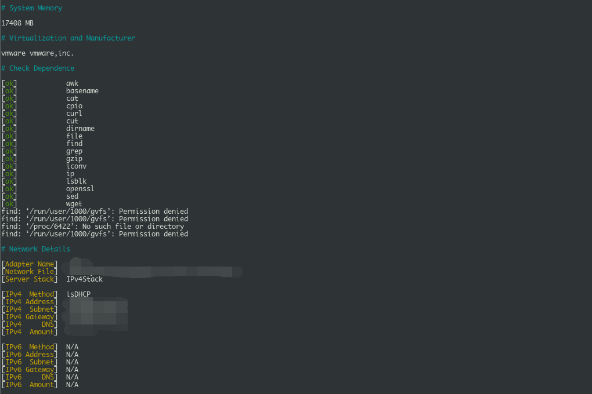
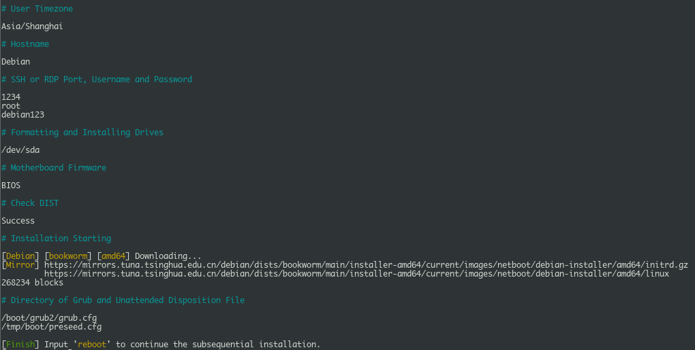

## 前言

在使用 VPS 时，可能会碰到主机商并没有提供我们所需要的系统，或者有些主机商的操作系统会带一些 “无关” 进程；这个时候我们就可以通过一键重装工具来安装一款我们需要的，干净的操作系统。

- [Github项目地址](https://github.com/leitbogioro/Tools)

---

## 使用说明

### 准备工作

下载脚本：

```bash
wget --no-check-certificate -qO InstallNET.sh 'https://raw.githubusercontent.com/leitbogioro/Tools/master/Linux_reinstall/InstallNET.sh' && chmod a+x InstallNET.sh
```

国内主机使用以下命令：

```bash
wget --no-check-certificate -qO InstallNET.sh 'https://gitee.com/mb9e8j2/Tools/raw/master/Linux_reinstall/InstallNET.sh' && chmod a+x InstallNET.sh
```

如果报错，则需要安装 `wget`

Debian 系：

```bash
apt update -y
apt install -y wget
```

RedHat 7：

```bash
yum install -y wget
```

Redhat 8(8+)：

```bash
dnf install wget -y
```

Alpine Linux：

```bash
apk update
apk add bash wget
sed -i 's/root:\/bin\/ash/root:\/bin\/bash/g' /etc/passwd
```

### 脚本参数

使用脚本时，需要自己添加参数；基本参数如下：

```bash
bash InstallNET.sh 
```

系统选择：

1. Debian

`-debian`

  > 可选 7-12 如安装 Debian 12 则参数为 `-debian 12`

2. CentOS

`-centos`

  > 可选 7、8/9-stream 如安装 CentOS7 则参数为 `-centos 7` CentOS 9 为`-centos 9-stream`

3. Ubuntu

`-ubuntu`

> 可选 20.04/22.04/24.04 ， 如 `-ubuntu 24.04`

4. Kali

`-kali`

  > 可选 rolling/dev/experimental 分别对应 Kali Rolling, Development 和 Experimental ， 如 `-kali rolling`

5. Alpine

`-alpine`

  > 可选 3.16-3.18/edge ， 如 `-alpine dege`

6. AlmaLinux

`almalinux` 或 `alma`

  > 可选 8/9 ， 如 `-alma 9`

7. RockyLinux

`-rockylinux` 或 `-rocky`

  > 可选 8/9 ， 如 `-rocky 9`

8. Fedora

`-fedora`

  > 可选 38/39 ， 如 `-fedora 39`

9. Windows

  > 可选 10/11/2012/2016/2019/2022 ， 如 `-windows 2022`

可选发行版列表：

  - Windows 10 Enterprise LTSC 22H2 for simplified Chinese and Japanese, 23H2 for English

  - Windows 11 Pro for Workstation 22H2 for simplified Chinese and Japanese, 23H2 for English

  - Windows Server 2012 R2

  - Windows Server 2016

  - Windows Server 2019

  - Windows Server 2022

其他基本参数：

`-lang/-language "cn"`

  > 此选项为 Windows 镜像设置语言， 如 `-lang "en"` `"cn"` 为简体中文， `"en"` 为英文， `"jp"`为日文。

`-port "22"`

 > 此选项为 Linux SSH 端口，默认为 22 可选 1~65535；该参数不可用于 Windows

`-pwd/-password "yourpassword"`

  > 此选项可为系统设置密码

`-hostname "yourhostname"`

  > 此选项可设置主机名

`-mirror "mirror url"`

  > 通过镜像下载安装，可设置与服务器实际位置接近的镜像地址以加快下载速度

如国内主机，可通过中科大源：

```
https://mirrors.ustc.edu.cn/debian/
```

或清华源：

```
https://mirrors.tuna.tsinghua.edu.cn/debian/
```

更多镜像地址如下：

Debian：

```
https://www.debian.org/mirror/list.html
```

CentOS7/8-stream：

```
https://www.centos.org/download/mirrors
```

CentOS 9-stream/+：

```
https://admin.fedoraproject.org/mirrormanager/mirrors/CentOS
```

Ubuntu：

```
https://launchpad.net/ubuntu/+cdmirrors
```

Kali：

```
https://http.kali.org/README.mirrorlist
```

Alpine Linux：

```
https://mirrors.alpinelinux.org/
```

RockyLinux：

```
https://mirrors.rockylinux.org/mirrormanager/mirrors
```

Fedora：

```
https://admin.fedoraproject.org/mirrormanager/mirrors/Fedora
```

`-timezone "Asia/Shanghai"`

  > 手动设置时区，若输入的时区参数有误，则自动设置为 "Asia/Tokyo"；若未设置该参数，则按照访客 IP 地理位置分配，该选项不可用于 Windows 系统


`-swap/-virtualmemory/-virtualram "4096"`

  > 指定磁盘空间为 Linux 添加交换分区，单位为 MB， 如添加 2GB Swap， 参数为 `-swap "2048"`

### 使用参考：

例如国内服务器从清华大学源下载 Debian12 镜像安装，设置时区为 Asia/Shanghai，并设置主机名、SSH 端口、密码、交换分区：

```bash
bash InstallNET.sh -debian 12 -mirror "https://mirrors.tuna.tsinghua.edu.cn/debian/" -hostname "Debian" -port "1234" -pwd "debian123" -timezone "Asia/Shanghai" -swap "2048"
```

回车后等待脚本运行，运行完成后检查配置一致性（网络配置和自定义配置是否正确）：





确定后即可输入 `reboot` 重启 VPS 等待重新安装了，此时可通过主机商提供的 VNC 连接查看安装过程。

详细使用说明请查看 [Linux reinstall useage](https://github.com/leitbogioro/Tools/blob/master/README.md)

---

## 参考资料

1. [Github 项目地址](https://github.com/leitbogioro/Tools)

2. [Linux reinstall useage](https://github.com/leitbogioro/Tools/blob/master/README.md)