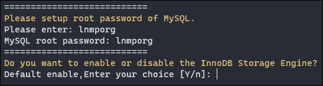

## 前言

- LNMP一键安装包是什么

LNMP一键安装包是一个用 Linux Shell 编写的可以为 Linux VPS 或独立主机安装 LNMP(Nginx/MySQL/PHP)、LNMPA(Nginx/MySQL/PHP/Apache)、LAMP(Apache/MySQL/PHP) 生产环境的 Shell 程序。

- 我们为什么需要它?

编译安装需要输入大量的命令，如果是配置生产环境需要耗费大量的时间。
不会 Linux 的站长或 Linux 新手想使用 Linux 作为生产环境……

- 它有什么优势和功能?

无需一个一个的输入命令，无需值守，编译安装优化编译参数，提高性能，解决不必要的软件间依赖，特别针对配置自动优化。

<!--more-->

---

## 安装教程

### 说明

- [LNMP 一键安装包官网](https://lnmp.org)

- 注意事项

> 需要 5GB 以上可用空间，MySQL 5.7,MariaDB 10 至少 9GB 剩余空间, MySQL8.0 最新版至少 25GB 以上.
> 
> 需要 128MB 以上内存( 128MB 小内存 VPS , Xen 需有 SWAP,OpenVZ 至少要有 128MB 以上的 vSWAP 或突发内存)，注意小内存请勿使用 64 位系统！
> 
> **安装 MySQL 5.6 或 5.7 及 MariaDB 10 必须 1G 以上内存，更高版本至少要 2G 内存!。**
> **安装 PHP 7 及以上版本必须 1G 以上内存!。**
> 
> 不要在非常新的 Linux 发行版上安装旧的 PHP/MySQL 版本，同理不要在旧的 Linux 发行版上安装非常新的PHP/MySQL 版本。
> 
> CentOS 6、8 请用 lnmp 1.9+ 版本进行安装！
> 
> Ubuntu 18+,Debian 9+,Mint 19+,Deepin 15.7+ 及所有新的 Linux 发行版只能使用 1.7+ 进行安装！
> 
> PHP 7.1.* 以下版本不支持 Ubuntu 19+、Debian 10+ 等等非常新的 Linux 发行版！
> 
> 阿里云 Ubuntu 14.04 系统模版有问题不要用！！！
> 
> PHP 7.4 升级或安装必须 CentOS 7+,Debian 8+,Ubuntu 16.04+ 且必须使用 1.7+ ！！！
> 
> MySQL 8.0.23 以下版本升级或安装必须 CentOS 8+,Debian 9+,Ubuntu 16.04+ 且必须使用 1.7+ ！！！
> 
> MySQL 8.0.24 以上版本升级或安装必须 Debian 11+,Ubuntu 20.04+,Fedora 33+ 且必须使用 1.8+ ！！！

---

### 安装步骤

1. 使用 SSH 工具登录 VPS 或服务器

为防止本地网络变化等不确定因素导致安装终止，先键入命令创建一个作业窗口：

```bash
screen -S lnmp
```

如果提示 `screen: command not found` 命令不存在可以执行： `yum install screen` 或 `apt-get install screen` 安装

---

2. 下载并安装 LNMP 一键安装包

```bash
wget http://soft.vpser.net/lnmp/lnmp1.9.tar.gz -cO lnmp1.9.tar.gz && tar zxf lnmp1.9.tar.gz && cd lnmp1.9 && ./install.sh lnmp
```

> 如需要安装 LNMPA 或 LAMP ，将 `./install.sh` 后面的参数 `lnmp` 替换为 `lnmpa` 或 `lamp` 即可。同时也支持单独安装 Nginx 或数据库，命令为 ` ./install.sh nginx` 或  `./install.sh db` 
> 如需更改网站和数据库目录、自定义 Nginx 参数、 PHP 参数模块是否安装、开启 lua 等需在运行 ` ./install.sh` 命令前修改安装包目录下的 lnmp.conf 文件，详细可以查看 lnmp.conf 文件参数说明。

---

3. 安装步骤

运行上述命令后即可开始安装，目前提供了较多的 MySQL、MariaDB 版本和不安装数据库的选项，**需要注意的是 MySQL 5.6,5.7 及 MariaDB 10 必须在 1G 以上内存的更高配置上才能选择！**

输入对应 MySQL 或 MariaDB 版本前面的序号，回车进入下一步：


> 如果选择 MySQL 5.7、8.0 且是 x86 或 x86_64 架构会提示： `Using Generic Binaries [y/n]` 这一步是提示是否使用二进制安装，输入 y 为使用二进制安装，输入 n 为使用源码编译安装。

设置 MySQL 的 root 密码（直接回车将会设置为 lnmp.org#随机数字）如果输入有错误需要删除时，可以按住 Ctrl 再按 Backspace 键进行删除(个别情况下是只需按 Backspace 键)。输入后回车进入下一步，如图：



> 询问是否需要启用 MySQL InnoDB，InnoDB 引擎默认为开启，一般建议开启，直接回车或输入 y ，如果确定确实不需要该引擎可以输入 n 

输入要选择的 PHP 版本的序号，回车进入下一步，**注意：选择 PHP 7+ 版本时需要自行确认 PHP 版本是否与自己的程序兼容**：


> 选择是否安装内存优化：可以选择不安装、 Jemalloc 或 TCmalloc ，输入对应序号回车，直接回车为默认为不安装。

进行完上述操作后，会提示 `Press any key to install...or Press Ctrl+c to cancel` ，按回车键确认开始安装；LNMP 脚本就会自动安装编译 Nginx、MySQL、PHP、phpMyAdmin 等软件及相关的组件。

安装时间可能会几十分钟到几个小时不等，主要是机器的配置网速等原因会造成影响。

- LNMP 一键安装包编译过程需要大量的时间，所以需要耐心等待。如果网络掉线，可以重新连接 SSH，再执行 `screen -r lnmp` 就会看到你的 lnmp 安装进程；如果没恢复窗口，可以输入 `screen -ls` 列出窗口进程，然后输入 `screen -D -r XX(进程编号)` 进行恢复：


---

1. 完成安装

完成安装后，会显示如下：

```bash
============================== Check install ==============================
Checking ...
Nginx: OK
MySQL: OK
PHP: OK
PHP-FPM: OK
Clean Web Server src directory...
```


> Nginx、MySQL、PHP 都是 running，80和3306端口都存在，并提示安装使用的时间及 Install lnmp V1.9 completed! enjoy it. 的话，说明已经安装成功。

---

1. 安装 PHP 组件

安装完 LNMP 后可以按自己的需求安装 eAccelerator、xcache、memcached、imageMagick、ionCube、redis、opcache。这几个 PHP 缓存、加速类的扩展不一定对每个人都能用，自己按需要安装，不用装多个同类的扩展，可能会导致出错。

这些扩展和组件均采用 `./addons.sh` 进行安装；基本用法说明：

```bash
./addons.sh {install|uninstall}
{eaccelerator|xcache|memcached|opcache|redis|imagemagick|ioncube}
```

例如安装常用的 Memcached、Redis、imageMagick 命令如下：

```bash
./addons.sh install memcached # 安装 Memcached
./addons.sh install redis # 安装 Redis
./addons.sh install imagemagick # 安装 imageMagick
```

以安装 Memcached 为例，演示如下：


安装完成提示：

```bash
Starting Memcached...
Starting memcached:  done
====== Memcached install completed ======
Memcached installed successfully, enjoy it!
```

---

## 网站管理

### 添加/删除网站(虚拟主机)

虚拟主机管理基本命令介绍：

```bash
lnmp vhost add # 添加网站
lnmp vhost list # 网站列表
lnmp vhost del # 删除网站
```

执行：`lnmp vhost add` 并按照下面操作添加网站（点击放大）：


最后按下任意键，即可开始添加网站了，添加完成后提示如下：


网站架设完成

---

### 上传程序

直接使用 SFTP 软件登陆 root 账户进行上传，上传完成后设置相关权限即可。

> 上传网站后建议执行：`chown www:www -R /path/to/dir` 对网站目录进行权限设置，`/path/to/dir` 替换为你网站目录。

如果需要单独的 FTP 账户进行上传，那么就安装 FTP 服务器，并创建 FTP 用户进行上传

#### 安装 pureftpd 

进入 LNMP 解压缩后的文件夹，输入 `./pureftpd.sh` 会提示按任意键安装：


按下任意键，等待安装完成，出现如下提示：


- FTP命令

```bash
lnmp ftp add # 添加FTP用户
lnmp ftp del # 删除FTP用户
lnmp ftp edit # 编辑FTP用户
```

---

## 总结

LNMP 一键安装包和 Oneinstack之间大差不差，只是一些细节之间的不同；可以按照自己的喜好进行选择，但它们都更适合有一定 Linux 使用基础的人，新手的话还是更建议使用可视化面板。

最后贴上 LNMP 一键安装包详细的使用说明：[LNMP 一键安装包常见问题](https://lnmp.org/category/faq/)