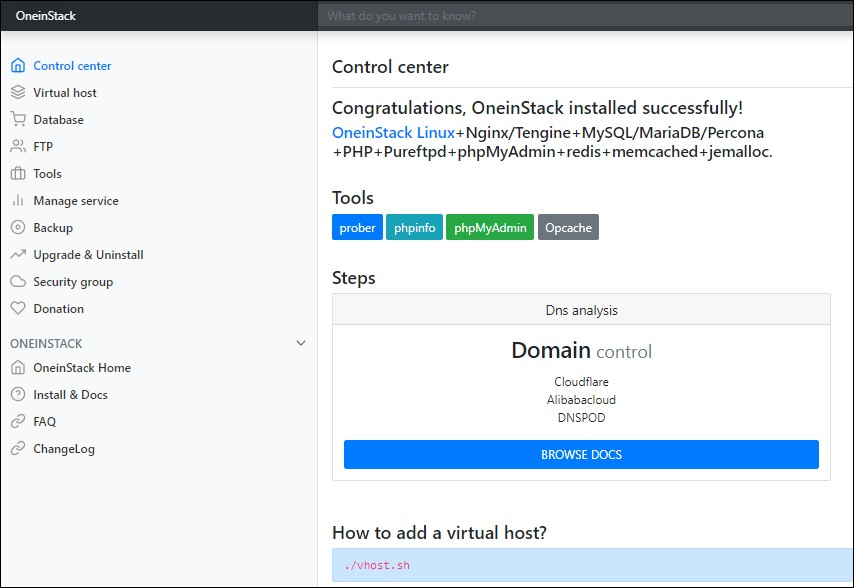
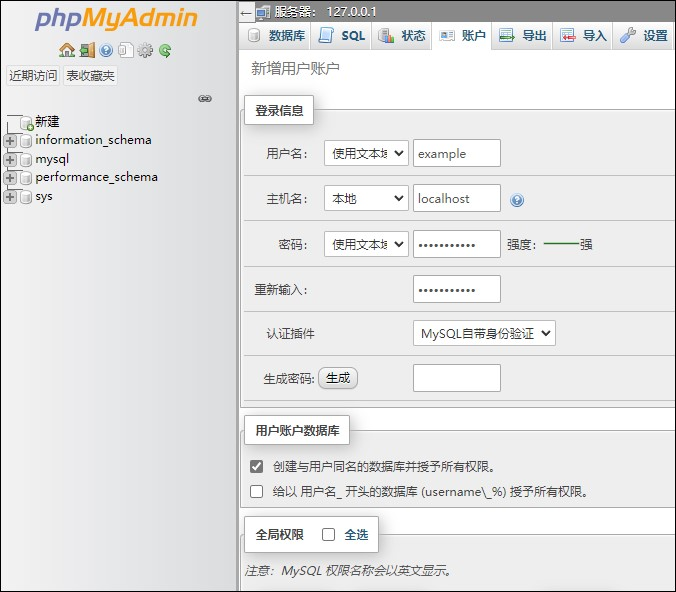

## 前言

### 什么是 LNMP
LNMP代表的就是：Linux 系统下 Nginx+MySQL+PHP 这种网站服务器架构。
Linux 是一类 Unix 计算机操作系统的统称，是目前最流行的免费操作系统。代表版本有：debian、centos、ubuntu、fedora、gentoo 等。
Nginx 是一个高性能的 HTTP 和反向代理服务器，也是一个 IMAP/POP3/SMTP 代理服务器。
Mysql 是一个小型关系型数据库管理系统。
PHP 是一种在服务器端执行的嵌入 HTML 文档的脚本语言。
这四种软件均为免费开源软件，组合到一起，成为一个免费、高效、扩展性强的网站服务系统。

<!--more-->

---

## 安装

- [Oneinstack 官网](https://oneinstack.com)

OneinStack包含以下组合：

> - lnmp（Linux + Nginx+ MySQL/MongoDB+ PHP）
> - lamp（Linux + Apache+ MySQL/MongoDB+ PHP）
> - lnmpa（Linux + Nginx+ MySQL/MongoDB+ PHP+ Apache）：Nginx 处理静态，Apache 处理动态 PHP
> - lnmt（Linux + Nginx+ MySQL/MongoDB+ Tomcat）：Nginx 处理静态，Tomcat（JDK）处理 JAVA
> - lnpp（Linux + Nginx+ PostgreSQL+ PHP）
> - lapp（Linux + Apache+ PostgreSQL+ PHP）
> - lnmh（Linux + Nginx+ MySQL+ HHVM）

- 安装说明

点击链接进入 OneinStack 官网，点击自动安装；然后选择自己所需要的组合，并视情况选择组件，然后就会生成相应的一键安装命令：


为防止本地网络变化等不确定因素导致安装终止，先键入命令创建一个作业窗口：

```bash
screen -S lnmp
```

> 若报错先安装 `screen` ：

```bash
apt-get install -y screen
```

然后复制 OneinStack 一键安装命令粘贴至终端，接下来就是耐心等待，安装时间视你所选组件的多少以及服务器配置而定。

安装完成后提示安装时长和组件路径：


```bash
####################Congratulations########################
Total OneinStack Install Time: 28 minutes

Nginx install dir:              /usr/local/nginx

Database install dir:           /usr/local/mysql
Database data dir:              /data/mysql
Database user:                  root
Database password:              oneinstack

PHP install dir:                /usr/local/php
Opcache Control Panel URL:      http://192.168.0.160/ocp.php

Pure-FTPd install dir:          /usr/local/pureftpd
Create FTP virtual script:      ./pureftpd_vhost.sh

phpMyAdmin dir:                 /data/wwwroot/default/phpMyAdmin
phpMyAdmin Control Panel URL:   http://192.168.0.160/phpMyAdmin

redis install dir:              /usr/local/redis

memcached install dir:          /usr/local/memcached

Index URL:                      http://192.168.0.160/
```

此时键入 `reboot` 命令，重启 VPS。

至此 LNMP 环境安装完成。

---

## 开设站点

### 安装检查

首先打开浏览器，进入 Oneinstack 的默认首页，即服务器 `IP` 地址，就可以看到默认页面：



到这说明已经成功搭建 Lnmp

---

### 创建虚拟主机

键入下面命令，添加虚拟主机并绑定域名。

> 注意域名应该提前解析至你的主机IP

```bash
cd /root/oneinstack/
./vhost.sh
```

流程如下：


---

### 创建MySQL数据库

Oneinstack 提供 phpMyAdmin 在线管理 Mysql；打开浏览器，输入 `ip/phpMyAdmin` 登录到 phpMyAdmin：


然后点击账户 > 新建用户账户，新增数据库与用户，并确认执行：



创建完虚拟主机以及数据库后就可以上传程序并进行安装了

---

## 扩展配置

### 添加附加组件

如果之前没有安装组件，后续补充安装，统一入口为 `./install.sh` ，详细如下：

```bash
#######################################################################
#       OneinStack for CentOS/RedHat 7+ Debian 9+ and Ubuntu 16+      #
#       For more information please visit https://oneinstack.com      #
#######################################################################
version: 2.6
updated date: 2022-09-03
Usage: ./install.sh  command ...[parameters]....
  --help, -h                  Show this help message, More: https://oneinstack.com/auto
  --version, -v               Show version info
  --nginx_option [1-3]        Install Nginx server version
  --apache                    Install Apache
  --apache_mode_option [1-2]  Apache2.4 mode, 1(default): php-fpm, 2: mod_php
  --apache_mpm_option [1-3]   Apache2.4 MPM, 1(default): event, 2: prefork, 3: worker
  --php_option [1-11]         Install PHP version
  --mphp_ver [53~81]          Install another PHP version (PATH: /usr/local/php${mphp_ver})
  --mphp_addons               Only install another PHP addons
  --phpcache_option [1-4]     Install PHP opcode cache, default: 1 opcache
  --php_extensions [ext name] Install PHP extensions, include zendguardloader,ioncube,
                              sourceguardian,imagick,gmagick,fileinfo,imap,ldap,calendar,phalcon,
                              yaf,yar,redis,memcached,memcache,mongodb,swoole,xdebug
  --nodejs                    Install Nodejs
  --tomcat_option [1-4]       Install Tomcat version
  --jdk_option [1-2]          Install JDK version
  --db_option [1-14]          Install DB version
  --dbinstallmethod [1-2]     DB install method, default: 1 binary install
  --dbrootpwd [password]      DB super password
  --pureftpd                  Install Pure-Ftpd
  --redis                     Install Redis
  --memcached                 Install Memcached
  --phpmyadmin                Install phpMyAdmin
  --python                    Install Python (PATH: /usr/local/python)
  --ssh_port [No.]            SSH port
  --iptables                  Enable iptables
  --reboot                    Restart the server after installation
```

> 如之前没有安装 `php redis` 以及 `imagick` 扩展，补充安装命令： `./install.sh --php_extensions redis,imagick`

---

### 删除虚拟主机

```bash
cd /root/oneinstack
./vhost.sh --del
```


---

### 管理 FTP 账号

```bash
cd /root/oneinstack
./pureftpd_vhost.sh
```


---

### 备份管理

```bash
cd /root/oneinstack
./backup_setup.sh
```


---

## 总结

Oneinstack 是国内优秀的 LNMP 和 LAMP 生产环境的 Shell 程序，Oneinstack 最大的问题就是需要懂得一点Linux 知识，Oneinstack 自带了很多常用的静态规则，但碰到一些需要自定义的规则时就麻烦了。

最后贴上一些基本使用手册： [Oneinstack基本使用手册](https://oneinstack.com/install/)